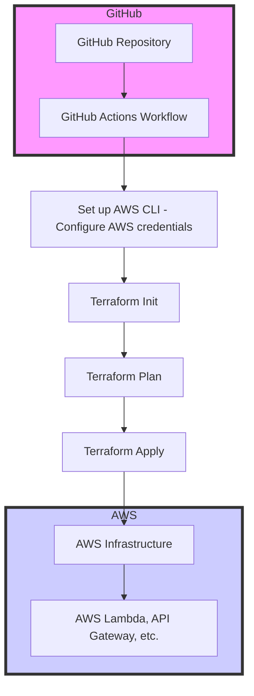

# Triggering GitHub Actions

# CI/CD with Terraform and GitHub Actions for AWS

This project demonstrates how to set up **CI/CD pipelines** using **Terraform** and **GitHub Actions** to automate the deployment of infrastructure on **AWS**. The primary goal is to automate the process of provisioning cloud resources using Terraform, with the help of GitHub Actions, triggered by code pushes to the `main` branch.

## Overview

The project includes:
- **GitHub Actions** to automate the CI/CD pipeline.
- **Terraform** to manage infrastructure as code (IaC).
- **AWS** as the cloud provider for deploying resources.

### Architectural Diagram


## Explanation of the Diagram:
- **GitHub Repository (A)** -This is where the Terraform configuration files and GitHub Actions workflow file are stored.
- **GitHub Actions Workflow (B)** -The deploy.yml file in the .github/workflows/ directory triggers the CI/CD pipeline.
- **Set up AWS CLI (C)** -AWS credentials are configured in GitHub Actions to authenticate the connection with AWS.
- **Terraform Init (D)** -Initialises the Terraform configuration in the workflow.
- **Terraform Plan (E)** -Terraform plans the infrastructure changes.
- **Terraform Apply (F)** -The Terraform apply step is executed to apply the changes to the AWS infrastructure.
- **AWS Infrastructure (G)** -The resources are provisioned on AWS (such as Lambda functions, API Gateway, etc.).
- **AWS Lambda, API Gateway, etc. (H): The specific AWS resources deployed as per the Terraform configuration (example: Lambda, API Gateway).

This diagram represents the flow of the CI/CD pipeline, from code push in the GitHub repository to AWS infrastructure deployment.

### Workflow Overview

The CI/CD workflow is simple and performs the following tasks:
1. **Set up AWS credentials** for GitHub Actions.
2. **Terraform Init**: Initialize the Terraform configuration.
3. **Terraform Plan**: Show what Terraform intends to do (without applying any changes).
4. **Terraform Apply**: Apply the planned changes to AWS resources (such as Lambda, API Gateway, etc.).

---

## Project Setup

### 1. **GitHub Repository Setup**

To get started with this project, you first need to create a GitHub repository. The repository will store your Terraform configuration files and a GitHub Actions workflow file (`deploy.yml`).

### 2. **Creating the Workflow for CI/CD**

In your repository, create a directory structure like this:

```
.github/
  workflows/
    deploy.yml
```

The `deploy.yml` file will define the actions that need to happen when code is pushed to the repository.

Example `deploy.yml` file:
```yaml
name: Terraform CI/CD

on:
  push:
    branches:
      - main

jobs:
  terraform:
    runs-on: ubuntu-latest
    steps:
      - name: Checkout code
        uses: actions/checkout@v2

      - name: Set up AWS CLI
        uses: aws-actions/configure-aws-credentials@v1
        with:
          aws-access-key-id: ${{ secrets.AWS_ACCESS_KEY_ID }}
          aws-secret-access-key: ${{ secrets.AWS_SECRET_ACCESS_KEY }}
          aws-region: us-east-1

      - name: Set up Terraform
        uses: hashicorp/setup-terraform@v1
        with:
          terraform_version: 1.0.0

      - name: Terraform Init
        run: terraform init

      - name: Terraform Plan
        run: terraform plan

      - name: Terraform Apply
        run: terraform apply -auto-approve
```

### 3. **Terraform Setup**

In your repository, create your Terraform configuration files. These files define the cloud infrastructure to be managed by Terraform. For example, you might have files like `main.tf`, `variables.tf`, `outputs.tf`, etc.

Example `main.tf` (for AWS Lambda):
```hcl
provider "aws" {
  region = "us-east-1"
}

resource "aws_lambda_function" "example_lambda" {
  filename      = "lambda.zip"
  function_name = "example_lambda_function"
  role          = aws_iam_role.lambda_exec_role.arn
  handler       = "index.handler"
  runtime       = "nodejs14.x"
}
```

### 4. **Configure AWS Credentials in GitHub Secrets**

To allow GitHub Actions to interact with your AWS account, store your **AWS Access Key** and **AWS Secret Access Key** as secrets in your GitHub repository.

1. Go to your GitHub repository’s **Settings**.
2. Under **Secrets**, click on **New repository secret**.
3. Add two secrets:
   - `AWS_ACCESS_KEY`: Your AWS Access Key.
   - `AWS_SECRET_ACCESS_KEY`: Your AWS Secret Access Key.

### 5. **Triggering the Workflow**

Whenever you push code to the `main` branch of the repository, the GitHub Actions workflow will automatically run. The steps in the workflow will:
1. Check out the repository’s code.
2. Set up AWS credentials.
3. Initialize Terraform.
4. Show the Terraform plan.
5. Apply the changes to your AWS infrastructure.

### 6. **First Commit and Push**

Before you can trigger the workflow, make sure your repository contains all necessary files and has been pushed to GitHub.

```bash
# Create a README.md file and commit it
echo "# CI/CD with Terraform and GitHub Actions" > README.md
git add .
git commit -m "Initial commit with Terraform configuration and workflow"
git push origin master
```

This will trigger the workflow for the first time, running Terraform and deploying your resources.


## Explanation of Key Components

### Terraform Files

- `main.tf`: Defines the cloud infrastructure (e.g., Lambda functions, API Gateway, IAM roles).
- `variables.tf`: Stores variables used in Terraform (e.g., AWS region, Lambda handler).
- `outputs.tf`: Defines the outputs from Terraform (e.g., Lambda function ARN).

### GitHub Actions Workflow

- `.github/workflows/deploy.yml`: Defines the automation steps for the CI/CD pipeline.

### AWS Credentials

- Stored securely in GitHub Secrets, used by GitHub Actions to authenticate and deploy resources to AWS.


## Modifying the Project

To modify the project:
1. Update your Terraform configuration files (e.g., add new resources like S3 buckets, IAM roles).
2. Modify the `deploy.yml` workflow if you need to add or change steps (e.g., for additional resources or deployment steps).
3. Commit your changes and push them to GitHub.

GitHub Actions will automatically pick up the changes and run the CI/CD pipeline.


## Conclusion

This project helps automate the process of deploying infrastructure with Terraform using GitHub Actions. By pushing code to the `main` branch, the CI/CD pipeline runs automatically, managing your AWS resources seamlessly.

Ensure that you:
- Set up your GitHub repository with the correct files.
- Store AWS credentials securely in GitHub Secrets.
- Modify the Terraform configuration to fit your needs.

Now you have a CI/CD pipeline that automates your AWS infrastructure deployment!


